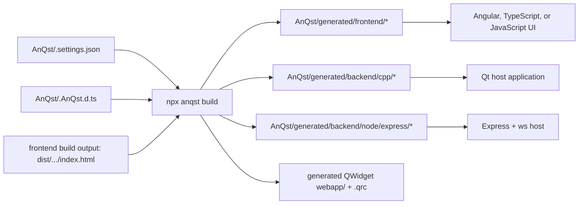
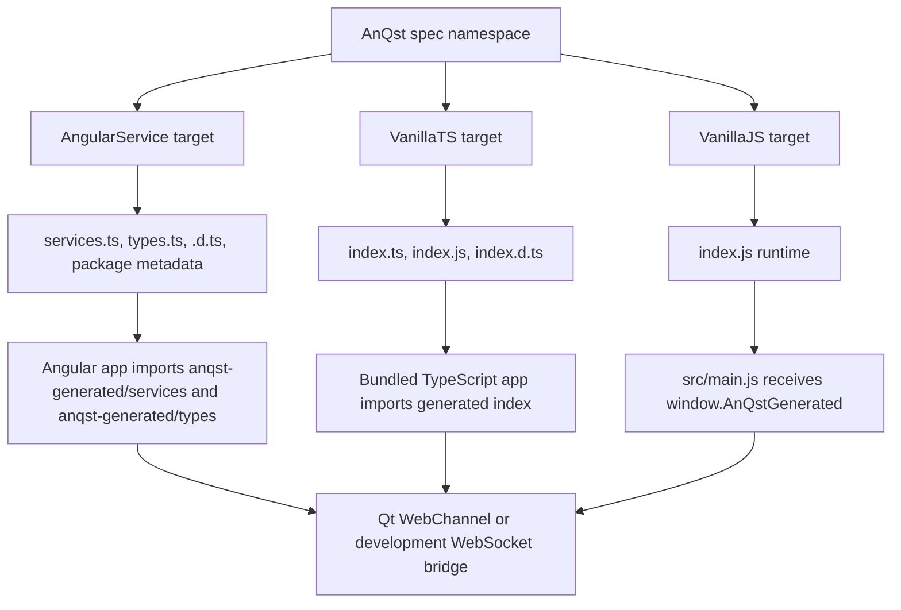
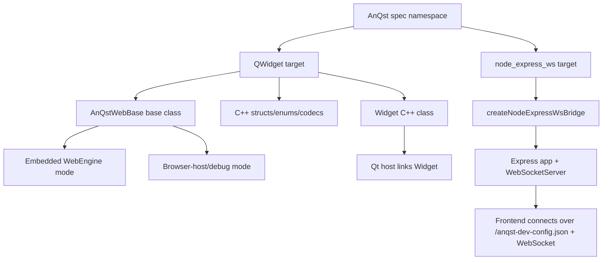

AnQst is a generator for widget bridge code: one TypeScript declaration spec becomes frontend bridge APIs and backend host APIs.
Use it to keep a browser UI, a Qt QWidget host, and an optional Node/Express host synchronized from the same AnQst spec.

# Building Your Widget

## Index

- [1. Install, Initialize, and Configure](#1-install-initialize-and-configure)
  - [1.1 Start From Nothing](#11-start-from-nothing)
  - [1.2 Initialize an Existing Widget Project](#12-initialize-an-existing-widget-project)
  - [1.3 CLI Parameters](#13-cli-parameters)
  - [1.4 Package and Settings Options](#14-package-and-settings-options)
  - [1.5 Environment Variables and CMake Options](#15-environment-variables-and-cmake-options)
- [2. Generated Project Relationships](#2-generated-project-relationships)
  - [2.1 Spec to Frontend Targets](#21-spec-to-frontend-targets)
  - [2.2 Spec to Backend Targets](#22-spec-to-backend-targets)
- [3. Building and Integrating Targets](#3-building-and-integrating-targets)
  - [3.1 Common Build Flow](#31-common-build-flow)
  - [3.2 AngularService Frontend](#32-angularservice-frontend)
  - [3.3 VanillaTS Frontend](#33-vanillats-frontend)
  - [3.4 VanillaJS Frontend](#34-vanillajs-frontend)
  - [3.5 QWidget Backend](#35-qwidget-backend)
  - [3.6 Node Express WebSocket Backend](#36-node-express-websocket-backend)
  - [3.7 Qt Designer Plugin](#37-qt-designer-plugin)
  - [3.8 Cleaning Generated Output](#38-cleaning-generated-output)

## 1. Install, Initialize, and Configure

### 1.1 Start From Nothing

AnQst is distributed as the npm package `@dusted/anqst`; the package exposes the local binary name `anqst`.
Install the package first, then call it through `npx anqst ...` from the project root.

```bash
mkdir MyWidgetProject
cd MyWidgetProject
npm init -y
npm install --save-dev @dusted/anqst
npx anqst instill MyWidget
```

This creates `./AnQst`, a starter `AnQst/MyWidget.AnQst.d.ts` spec, and `AnQst/MyWidget.settings.json`.
Edit the spec, verify it, then generate the selected targets:

```bash
npx anqst test
npx anqst build
```

If the project already has an Angular, TypeScript, or JavaScript frontend, keep using that normal frontend build system. AnQst generates the bridge code and, when a QWidget is selected, embeds a browser build output into the generated C++ widget tree.

### 1.2 Initialize an Existing Widget Project

Run the initializer in the npm project that owns the widget spec and browser frontend:

```bash
npm install --save-dev @dusted/anqst
npx anqst instill MyWidget
```

`npx anqst instill <WidgetName>` requires a `package.json`. It updates:

- `package.json` with `"AnQst": "./AnQst/<WidgetName>.settings.json"`.
- `package.json` scripts `postinstall`, `prebuild`, and `prestart` so they run `npx anqst build`.
- `tsconfig.json`, when present, with an `anqst-generated/*` path alias for Angular generated code.

It creates:

- `AnQst/<WidgetName>.AnQst.d.ts`: the widget spec source.
- `AnQst/<WidgetName>.settings.json`: project-local generator settings.
- `AnQst/.gitignore`: ignores generated output.
- `AnQst/README.md`: short local regeneration notes.

The spec must declare exactly one top-level namespace. The namespace name is the widget name and must match `widgetName` in settings.

```ts
import type { AnQst } from "@dusted/anqst";

declare namespace MyWidget {
  interface UserService extends AnQst.Service {
    findUser(id: string): AnQst.Call<string>;
    selectedUserId: AnQst.Input<string>;
    statusText: AnQst.Output<string>;
    refresh(): AnQst.Slot<void>;
    saved(id: string): AnQst.Emitter;
  }
}
```

### 1.3 CLI Parameters

All examples use the local project binary through `npx anqst ...`.

| Command | Parameters and options | What it does |
| --- | --- | --- |
| `npx anqst instill <WidgetName>` | `<WidgetName>` must be a valid TypeScript identifier. | Creates the `AnQst/` project files and hooks the npm project to AnQst. |
| `npx anqst install <WidgetName>` | Alias for `instill`. | Accepts common muscle-memory usage and routes to `instill`. |
| `npx anqst test` | No arguments. | Loads `package.json.AnQst`, parses the configured spec, and verifies it. |
| `npx anqst build` | `--designerplugin`, `--designerplugin=true`, `--designerplugin=false`, `--noShared`, `--useShared`. | Verifies the configured spec, regenerates selected targets, optionally embeds browser assets for QWidget, and optionally builds the Qt Designer plugin. |
| `npx anqst generate <specFile>` | One explicit spec path. | Verifies and generates outputs for that spec. It uses `package.json.AnQst` target settings when present, otherwise the default target list. It always emits shared-base QWidget CMake and does not run browser packaging or embedding. |
| `npx anqst verify <specFile>` | One explicit spec path. | Verifies a spec only. No files are written. |
| `npx anqst clean <path>` | A project path. | Loads settings under `<path>` and removes generated directories for that widget only. |
| `npx anqst clean <path> --force` | A project path plus `--force` or `-f`. | Removes `<path>/AnQst/generated` without reading project settings. |
| `npx anqst --writeSharedBaseWidget` | No arguments. | Writes the bundled `AnQstWebBase` source tree to `./AnQstWebBase` and exits. It refuses to overwrite an existing directory. |
| `npx anqst man` | No arguments. | Opens this manual in a console pager. On non-interactive output it prints the Markdown. |
| `npx anqst --help` | Also `-h` or `help`. | Prints CLI help. |
| `npx anqst --version` | Also `-v` or `version`. | Prints the AnQst package version. |

`--noShared` and `--useShared` only affect the current `npx anqst build` invocation. They override `useSharedBaseWidget` from settings without editing the settings file.

### 1.4 Package and Settings Options

The npm project must contain a `package.json` key named `AnQst`:

```json
{
  "AnQst": "./AnQst/MyWidget.settings.json"
}
```

The value must be a non-empty string path to the settings file. The settings file is a JSON object.

```json
{
  "layoutVersion": 2,
  "widgetName": "MyWidget",
  "spec": "./AnQst/MyWidget.AnQst.d.ts",
  "generate": ["QWidget", "AngularService", "VanillaTS", "VanillaJS", "node_express_ws"],
  "widgetCategory": "AnQst Widgets",
  "useSharedBaseWidget": true,
  "UseWebEngine": true
}
```

| Setting | Required | Values | Default | Effect |
| --- | --- | --- | --- | --- |
| `layoutVersion` | Yes | Number. Must be `2`. | `2` from `npx anqst instill`. | Guards the generated layout contract. Any other value is rejected. |
| `widgetName` | Yes | Non-empty string. In practice it must match the top-level spec namespace. | The `<WidgetName>` passed to `npx anqst instill`. | Names generated directories, classes, bridge objects, package metadata, and CMake targets. `npx anqst build` rejects a mismatch with the spec namespace. |
| `spec` | Yes | Non-empty string path that resolves inside `./AnQst`. | `./AnQst/<WidgetName>.AnQst.d.ts`. | Selects the spec file used by `npx anqst test` and `npx anqst build`. |
| `generate` | No | String array. Recognized values: `QWidget`, `AngularService`, `VanillaTS`, `VanillaJS`, `node_express_ws`. An empty array is allowed. | All recognized values: `["QWidget", "AngularService", "VanillaTS", "VanillaJS", "node_express_ws"]`. | Chooses output targets. Unknown strings are not useful and are ignored by target selection. The first browser target in this array controls QWidget browser asset handling. |
| `widgetCategory` | No | Non-empty string. | `AnQst Widgets`. | Qt Designer plugin group name when `--designerplugin` is used. |
| `useSharedBaseWidget` | No | Boolean. | `true`. | `true` means generated QWidget CMake expects an external ABI-matched `AnQstWebBase` target to already exist in the host CMake graph. `false` vendors `AnQstWebBase` into the generated widget tree and builds it with the widget. |
| `UseWebEngine` | No | Boolean. The capital `U` is part of the current setting name. | `true`. | `true` builds embedded Qt WebEngine support. `false` builds the widget for browser-host mode only and removes the Qt WebEngine dependency. The selected mode must match the `AnQstWebBase` target linked by CMake. |

Generated output is deterministic and lives under `AnQst/generated/`. Do not hand-edit that tree.

### 1.5 Environment Variables and CMake Options

#### AnQst CLI Environment

| Name | Values | Default | Used by | Effect |
| --- | --- | --- | --- | --- |
| `ANQST_DEBUG` | `true` enables it; any other value disables it. | Disabled. | `npx anqst build`, `npx anqst generate`. | Writes generator debug intermediates under `AnQst/generated/debug/intermediate`. |
| `ANQST_WEBBASE_DIR` | Path to an `AnQstWebBase` source directory. | For `--designerplugin`, AnQst first uses this when set, otherwise resolves bundled or vendored sources. | `npx anqst build --designerplugin`. | Passed to CMake as `-DANQST_WEBBASE_DIR=<path>`. |
| `ANQST_QT_MAJOR_VERSION` | `5` or `6`. | Not forwarded unless set for `--designerplugin`; CMake itself defaults to `5` when it cannot auto-detect. | `npx anqst build --designerplugin`. | Passed to CMake as `-DANQST_QT_MAJOR_VERSION=<5|6>`. |
| `PAGER` | Console pager command, for example `less -R` or `more`. | Linux: `less -R`; Windows: `more.com`. | `npx anqst man`. | Selects the manual reader. If paging fails, AnQst prints the manual. |

#### AnQst CMake Options

These are CMake cache variables for the generated QWidget path and the `AnQstWebBase` base class.

| CMake variable | Values | Default | Effect |
| --- | --- | --- | --- |
| `ANQST_QT_MAJOR_VERSION` | `5` or `6`. | `5`, unless CMake already has Qt targets from which AnQst can infer the major version. | Selects Qt5 or Qt6 for `find_package`. If both Qt5 and Qt6 targets are already present without a clear `Qt` or `Qt::Core` alias, CMake errors. |
| `ANQSTWEBBASE_BUILD_TESTS` | `ON` or `OFF`. | `ON` in standalone `AnQstWebBase`; generated widget integration forces `OFF`. | Builds or skips `AnQstWebBase` unit tests. Host applications should set this to `OFF` before adding the shared base. |
| `ANQSTWEBBASE_USE_WEBENGINE` | `ON` or `OFF`. | `ON` in standalone `AnQstWebBase`; generated widget integration forces the value from `UseWebEngine`. | Controls whether `AnQstWebBase` links `Qt::WebEngineWidgets`. Shared-base host projects must configure this to match `UseWebEngine`. |
| `ANQST_WEBBASE_DIR` | Path to `AnQstWebBase`. | Empty for shared Designer plugin builds; generated plugin CMake searches common project locations if empty. Vendored plugin builds default to the generated widget's `AnQstWebBase`. | Used by generated Qt Designer plugin CMake to locate the base class sources. |
| `CMAKE_PREFIX_PATH`, `Qt5_DIR`, `Qt6_DIR` | Standard CMake Qt discovery paths. | Environment-specific. | Not AnQst-specific, but commonly needed so CMake can find Qt. |

Generated CMake also defines internal variables such as `ANQST_PROJECT_ROOT`, `ANQST_GENERATED_WIDGET_DIR`, `ANQST_GENERATED_INCLUDE_DIR`, `ANQST_GENERATED_WIDGET_BINARY_DIR`, `ANQST_REQUIRED_GENERATED_FILES`, and `ANQST_GENERATED_WEBBASE_DIR`. Treat those as implementation details, not supported project configuration.

#### Runtime Environment Read by the Generated C++ Widget/Base

| Name | Values | Default | Effect |
| --- | --- | --- | --- |
| `ANQST_BYPASS_QWEBENGINE` | `true`, `yes`, `on`, or `1` enable it. Other values disable it. | Disabled. | Starts in browser-host mode and defers embedded `QWebEngineView` startup. Useful for headless, CI, or no-GPU environments. |
| `ANQST_WIDGET_DEBUG` | `true` enables it. Other values disable it. | Disabled. | Adds a visible debug border to the embedded WebEngine view. |
| `QTWEBENGINE_CHROMIUM_FLAGS` | Chromium flag string. | Inherited from the process. | AnQst reads the existing value and appends `--no-sandbox` if missing when WebEngine support is enabled. |
| `QTWEBENGINE_DISABLE_SANDBOX` | Standard Qt WebEngine variable. | AnQst sets it to `1` before starting trusted embedded WebEngine content. | Qt WebEngine consumes it. Setting it externally is normally unnecessary. |
| `QT_QPA_PLATFORM` | Standard Qt variable, for example `offscreen`. | Qt default. | Not read by AnQst code, but useful when running generated widgets in headless tests. |

Application-specific Node or Express variables, such as `PORT` or `STATIC_DIR` in the examples, are not generated AnQst variables.

## 2. Generated Project Relationships

The widget project owns the spec and the browser frontend. AnQst owns the generated bridge code. The host backend, whether Qt or Node/Express, consumes the generated backend API.



### 2.1 Spec to Frontend Targets



Frontend targets expose the same spec interactions:

- `AnQst.Call<T>` becomes an async frontend method that calls the host and resolves to `T`.
- `AnQst.Emitter` becomes a frontend method that emits a signal/event to the host.
- `AnQst.Input<T>` becomes frontend `set.<name>(value)` plus a local accessor.
- `AnQst.Output<T>` becomes a frontend accessor updated by the host.
- `AnQst.Slot<T>` becomes frontend `onSlot.<name>(handler)` for host-initiated calls.
- `AnQst.DropTarget<T>` and `AnQst.HoverTarget<T>` become frontend accessors carrying `{ payload, x, y }` state.

Angular output is designed for Angular dependency injection. VanillaTS and VanillaJS output install a browser global at `window.AnQstGenerated.<WidgetName>`.

### 2.2 Spec to Backend Targets



The QWidget backend generates a C++ class named `<WidgetName>Widget`. It inherits from `AnQstWebHostBase`, registers bridge endpoints, embeds the browser build into a Qt resource, and exposes a typed C++ API:

- Call handlers are registered through `widget->handle.<callName>(handler)`.
- Emitters become Qt signals.
- Inputs and outputs become Qt properties, setters, getters, and change signals.
- Slots become public Qt slots named `slot_<slotName>`.
- Drag/drop helpers are generated as static encode/decode functions when the spec uses drop or hover targets.

The Node/Express backend generates a TypeScript module named `AnQst/generated/backend/node/express/<WidgetName>_anQst`. It wires an Express app and a `ws` `WebSocketServer` to the same frontend bridge protocol.

## 3. Building and Integrating Targets

### 3.1 Common Build Flow

The normal flow is:

```bash
npx anqst test
npx anqst build
```

`npx anqst build` removes selected target roots before regenerating them, so stale generated files do not survive. It only writes under `AnQst/generated`, except that `VanillaJS` packaging writes `dist/browser` from `src/`.

The selected `generate` array controls outputs and also the browser asset embedding policy for QWidget. The first browser target in `generate`, considering only `AngularService`, `VanillaTS`, and `VanillaJS`, is the preferred browser frontend for embedding.

Examples:

```json
{ "generate": ["AngularService"] }
```

Generates Angular frontend bridge files only.

```json
{ "generate": ["QWidget", "AngularService"] }
```

Generates C++ QWidget files and Angular bridge files; when `angular.json` exists, `npx anqst build` runs `npx ng build --configuration production` and embeds the resulting browser output.

```json
{ "generate": ["QWidget", "VanillaTS"] }
```

Generates C++ QWidget and VanillaTS runtime files; you must build the TypeScript browser app to a `dist` tree with `index.html` before the final `npx anqst build` can embed it.

```json
{ "generate": ["QWidget", "VanillaJS", "VanillaTS"] }
```

Uses `VanillaJS` as the preferred browser frontend because it appears before `VanillaTS`.

### 3.2 AngularService Frontend

`AngularService` writes:

```text
AnQst/generated/frontend/<WidgetName>_Angular/
  package.json
  index.ts
  services.ts
  types.ts
  index.js
  services.js
  types.js
  types/
    index.d.ts
    services.d.ts
    types.d.ts
```

`npx anqst instill` adds this TypeScript path mapping when `tsconfig.json` exists:

```json
{
  "compilerOptions": {
    "baseUrl": ".",
    "paths": {
      "anqst-generated/*": [
        "AnQst/generated/frontend/<WidgetName>_Angular/*"
      ]
    }
  }
}
```

Angular components and services then import generated services and types:

```ts
import { UserService } from "anqst-generated/services";
import type { UserRecord } from "anqst-generated/types";
```

The generated service classes use `@Injectable({ providedIn: "root" })` and can be constructor-injected into Angular components. The bridge runtime first tries Qt WebChannel. If Qt WebChannel is unavailable, it fetches `/anqst-dev-config.json` and connects to the configured WebSocket bridge.

With `QWidget` enabled and `AngularService` as the first browser target:

- If `angular.json` exists, `npx anqst build` runs `npx ng build --configuration production`.
- AnQst searches `dist` and Angular `outputPath` locations for an `index.html`.
- The found browser output is copied into `AnQst/generated/backend/cpp/qt/<WidgetName>_widget/webapp`.
- `<base href="/">` is normalized to `<base href="./">`.
- Empty CSS links are removed when the referenced CSS file exists and is empty.
- `<WidgetName>.qrc` is updated so the C++ widget embeds the web assets.

Without `QWidget`, AngularService generation is independent of the frontend build. Run the normal Angular build after `npx anqst build`.

### 3.3 VanillaTS Frontend

`VanillaTS` writes:

```text
AnQst/generated/frontend/<WidgetName>_VanillaTS/
  package.json
  index.ts
  index.js
  index.d.ts
```

Use `index.ts` as an import in your TypeScript browser app:

```ts
import {
  createFrontend,
  type MyWidgetFrontend
} from "../AnQst/generated/frontend/MyWidget_VanillaTS/index";

async function boot() {
  const frontend: MyWidgetFrontend = await createFrontend();
  frontend.UserService.onSlot.refresh(() => undefined);
  await frontend.UserService.findUser("u-1");
}
```

For a QWidget build, AnQst does not build the VanillaTS app itself. Your project must bundle the app and create a browser output containing `index.html`, usually `dist/browser/index.html`.

A common script layout is:

```json
{
  "scripts": {
    "anqst:generate": "npx anqst generate ./AnQst/MyWidget.AnQst.d.ts",
    "frontend:build": "npm run anqst:generate && node build-frontend.mjs",
    "build": "npm run frontend:build && npx anqst build"
  }
}
```

The first `npx anqst generate` gives the TypeScript bundler the generated imports it needs. The final `npx anqst build` regenerates the selected targets and embeds the already-built `dist` browser output into the QWidget.

### 3.4 VanillaJS Frontend

`VanillaJS` writes:

```text
AnQst/generated/frontend/<WidgetName>_VanillaJS/
  package.json
  index.js
```

When `QWidget` is enabled and `VanillaJS` is the first browser target, `npx anqst build` performs the small browser packaging step itself. It requires:

```text
src/index.html
src/main.js
```

`src/main.js` must define a global `main(window, document, AnQstGenerated)` function. AnQst copies `src/` to `dist/browser`, prepends the generated runtime, and appends a call to `main(window, document, window.AnQstGenerated)`.

```js
async function main(window, document, AnQstGenerated) {
  const frontend = await AnQstGenerated.MyWidget.createFrontend();
  frontend.UserService.onSlot.refresh(() => undefined);
}
```

AnQst also normalizes `src/index.html` so `./main.js` is loaded with a deferred script tag and then embeds `dist/browser` into the QWidget.

When `QWidget` is not enabled, `VanillaJS` simply emits the generated runtime file for you to include in your own browser packaging.

### 3.5 QWidget Backend

`QWidget` writes:

```text
AnQst/generated/backend/cpp/
  cmake/
    CMakeLists.txt
  qt/
    <WidgetName>_widget/
      CMakeLists.txt
      <WidgetName>.cpp
      <WidgetName>.qrc
      include/
        <WidgetName>.h
        <WidgetName>Widget.h
        <WidgetName>Types.h
      webapp/
      designerPlugin/
```

The generated CMake entry point for host applications is:

```text
AnQst/generated/backend/cpp/cmake/CMakeLists.txt
```

It checks that the generated widget tree is complete, checks that `AnQstWebBase` is in the expected mode, and adds the generated widget library target named `<WidgetName>Widget`.

#### Shared AnQstWebBase

This is the default: `useSharedBaseWidget` omitted or `true`.

Use this when one host application consumes multiple generated widgets or when you want one central copy of `AnQstWebBase`. The host CMake project must add an ABI-matched base before adding generated widget integration CMake.

```cmake
cmake_minimum_required(VERSION 3.21)
project(MyHost LANGUAGES CXX)

set(CMAKE_CXX_STANDARD 17)
set(CMAKE_CXX_STANDARD_REQUIRED ON)
set(CMAKE_AUTOMOC ON)
set(CMAKE_AUTOUIC ON)
set(CMAKE_AUTORCC ON)

set(ANQSTWEBBASE_BUILD_TESTS OFF CACHE BOOL "Build AnQstWebBase unit tests" FORCE)
set(ANQSTWEBBASE_USE_WEBENGINE ON CACHE BOOL "Build embedded WebEngine support" FORCE)

add_subdirectory(
  "${CMAKE_CURRENT_SOURCE_DIR}/node_modules/@dusted/anqst/AnQstWebBase"
  "${CMAKE_CURRENT_BINARY_DIR}/anqstwebbase"
)

add_subdirectory(
  "${CMAKE_CURRENT_SOURCE_DIR}/AnQst/generated/backend/cpp/cmake"
  "${CMAKE_CURRENT_BINARY_DIR}/mywidget-anqst"
)

add_executable(my_host main.cpp)
target_link_libraries(my_host PRIVATE MyWidgetWidget)
```

Other valid shared-base source locations:

- `node_modules/@dusted/anqst/AnQstWebBase`, when the npm package is installed.
- A repo-local copy written by `npx anqst --writeSharedBaseWidget`.
- A source checkout such as `AnQst/AnQstWidget/AnQstWebBase`.

The base target name is ABI-stamped by the AnQst package version, for example `anqstwebhost_1.7.4`. The generated CMake checks that exact target. Adding the matching `AnQstWebBase` source directory creates both the ABI-stamped target and a shorthand `anqstwebhost` alias.

If `UseWebEngine` is `false`, set `ANQSTWEBBASE_USE_WEBENGINE OFF` before adding the shared base. A mismatch between the generated widget setting and the shared base target is a CMake error.

#### Vendored/Embedded AnQstWebBase

Set this in settings:

```json
{
  "useSharedBaseWidget": false
}
```

Or override one build:

```bash
npx anqst build --noShared
```

AnQst copies `AnQstWebBase` into:

```text
AnQst/generated/backend/cpp/qt/<WidgetName>_widget/AnQstWebBase/
```

The generated integration CMake then builds that vendored base automatically. Host CMake does not need a separate `add_subdirectory` for `AnQstWebBase`:

```cmake
add_subdirectory(
  "${CMAKE_CURRENT_SOURCE_DIR}/AnQst/generated/backend/cpp/cmake"
  "${CMAKE_CURRENT_BINARY_DIR}/mywidget-anqst"
)

target_link_libraries(my_host PRIVATE MyWidgetWidget)
```

Vendoring is easiest for a single widget or for shipping generated widget source as a self-contained dependency. Shared base is usually better when one host links several widgets.

#### Browser Assets Required by QWidget

The C++ widget expects `webapp/index.html` to exist before the host CMake build. `npx anqst build` creates that directory when it can find or build a browser frontend output. If you generate `QWidget` without any browser target, or before producing a `dist` tree, generation can succeed while the later CMake host build fails with an incomplete generated tree error.

Reliable QWidget build order:

```bash
npx anqst test
# Build or package the selected browser frontend when needed.
npx anqst build
cmake -S . -B build -DANQST_QT_MAJOR_VERSION=6
cmake --build build
```

### 3.6 Node Express WebSocket Backend

`node_express_ws` writes:

```text
AnQst/generated/backend/node/express/<WidgetName>_anQst/
  package.json
  index.ts
  types/
    index.d.ts
```

The generated module exports:

- `create<WidgetName>NodeExpressWsBridge(options)`.
- `<WidgetName>NodeImplementation`, the handler shape your backend must implement.
- `<WidgetName>HandlerBridge`, passed to backend handlers so they can call frontend slots, set frontend outputs, and inspect connected sessions.
- `AnQstDiagnostic`, emitted by bridge diagnostics subscriptions.

Minimal host shape:

```ts
import express from "express";
import http from "http";
import { WebSocketServer } from "ws";
import {
  createMyWidgetNodeExpressWsBridge,
  type MyWidgetNodeImplementation
} from "./AnQst/generated/backend/node/express/MyWidget_anQst/index";

const app = express();
app.use(express.static("dist/browser"));

const server = http.createServer(app);
const wsServer = new WebSocketServer({ server });

const implementation: MyWidgetNodeImplementation = {
  UserService: {
    async findUser(_bridge, id) {
      return `user:${id}`;
    },
    selectedUserId(_bridge, value) {
      console.log("selected", value);
    }
  }
};

const bridge = createMyWidgetNodeExpressWsBridge({
  app,
  wsServer,
  implementation
});

bridge.subscribeDiagnostics((diagnostic) => {
  if (diagnostic.severity === "error" || diagnostic.severity === "fatal") {
    console.error(diagnostic.message);
  }
});

server.listen(3000);
```

Bridge options:

| Option | Default | Effect |
| --- | --- | --- |
| `app` | Required. | Express app receiving the dev config route. |
| `wsServer` | Required. | `ws` server receiving browser bridge connections. |
| `implementation` | Required. | Service handler implementation generated from the spec. |
| `wsPath` | `/anqst-bridge`. | WebSocket path advertised to the frontend. |
| `wsUrl` | Computed from the incoming request. | Explicit WebSocket URL advertised through dev config. Useful behind proxies. |
| `devConfigPath` | `/anqst-dev-config.json`. | HTTP route the frontend fetches when Qt WebChannel is not available. |
| `defaultSlotTimeoutMs` | `1000`. | Default timeout for backend-to-frontend slot calls. |
| `maxQueuedSlotInvocationsPerSlot` | `1024`. | Maximum queued slot invocations before the oldest queued request is dropped. |

This backend is useful for web-hosted development and for non-Qt deployments. It does not build the frontend; it only supplies the bridge endpoint. Serve the Angular, VanillaTS, or VanillaJS browser build through Express or another static server.

### 3.7 Qt Designer Plugin

Build a plugin for the generated QWidget with:

```bash
npx anqst build --designerplugin
```

Requirements:

- `QWidget` must be enabled in `generate`.
- CMake must be available.
- Qt UiPlugin development files must be installed.
- `AnQstWebBase` must be locatable. AnQst uses `ANQST_WEBBASE_DIR` when set, otherwise bundled or vendored locations.

Useful variants:

```bash
ANQST_QT_MAJOR_VERSION=6 npx anqst build --designerplugin
ANQST_WEBBASE_DIR=/absolute/path/to/AnQstWebBase npx anqst build --designerplugin=true
npx anqst build --designerplugin=false
```

The plugin sources are generated under:

```text
AnQst/generated/backend/cpp/qt/<WidgetName>_widget/designerPlugin/
```

The binary is built under that directory's `build/` subdirectory. The plugin group in Qt Designer comes from `widgetCategory`.

### 3.8 Cleaning Generated Output

To remove generated files for the configured widget only:

```bash
npx anqst clean .
```

This reads `package.json.AnQst`, resolves the widget name, and removes that widget's generated frontend, backend, CMake, and debug directories.

To remove the entire generated tree without reading settings:

```bash
npx anqst clean . --force
```

This removes `AnQst/generated`.
