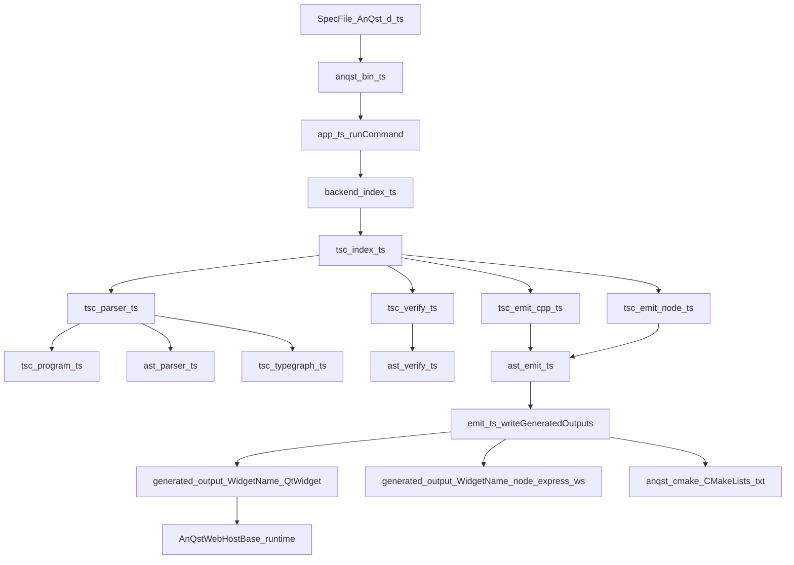

# Current Architecture: Spec -> TSC -> QtWidget

This document describes current implementation flow only.

Do not implement from this document. Use discussion workflow from `00-Agent-Operating-Protocol.md`.

## 1) End-to-End Runtime of `generate --backend tsc`

1. CLI receives command and arguments in `AnQstGen/src/bin/anqst.ts`.
2. `runCommand(...)` in `AnQstGen/src/app.ts` routes command and resolves backend.
3. For `tsc`, generation targets are filtered by `generationTargetsForBackend(...)`:
   - QWidget: allowed
   - node_express_ws: allowed
   - AngularService: forcibly disabled for current TSC path
4. `resolveBackend("tsc")` returns `tscBackend` from `AnQstGen/src/backend/tsc/index.ts`.
5. TSC parse stage:
   - `createTscProgramContext(...)` builds TypeScript Program and checker.
   - AST parser builds initial model.
   - `applyResolvedTypeGraph(...)` normalizes payload/parameter type text from checker output.
6. TSC verify stage:
   - `getProgramDiagnostics(...)` checks compiler diagnostics.
   - AST verifier validates semantic DSL rules.
7. Emit stage:
   - `emitCppQWidget(...)` and/or `emitNodeExpressWs(...)` execute.
   - TSC emit adapters delegate to AST emitter implementation.
8. Artifact persistence:
   - `writeGeneratedOutputs(...)` writes to `generated_output/*`.
   - `installQtIntegrationCMake(...)` writes `anqst-cmake/CMakeLists.txt` when QWidget is enabled.
9. Build mode extras (`anqst build` path):
   - if Angular project is present, `ng build --configuration production` runs.
   - `installEmbeddedWebBundle(...)` copies built web assets into generated Qt widget `webapp/*` and rewrites `.qrc`.

## 2) Architecture Diagram

## 3) Module Boundaries and Responsibilities

### Spec and model interpretation boundary

- AST parser defines baseline interpretation of the DSL structure.
- TSC layer augments type text with checker-resolved forms.
- Result is a normalized `ParsedSpecModel` consumed by verifier/emitter.

### Verification boundary

- TSC diagnostics are treated as hard verification failures.
- AST verification then enforces semantic DSL rules.

### Emit boundary

- TSC backend does not own separate QWidget templates.
- TSC adapters call AST emitter with selective target flags.

### Runtime host boundary

- Generated Qt widget class inherits host base and exposes generated member APIs.
- Generated class includes one-way `enableDebug()` pass-through.
- Transport bootstrap is host-owned; generated runtime bridges to host transport surface.

## 4) Primary Branch Points

### Backend branch (`ast` vs `tsc`)

- Resolved in `app.ts` via `--backend`.
- TSC branch adds checker-backed parsing/diagnostics behavior.

### Target branch (`AnQst.generate`)

- Parsed from package config.
- For TSC path, AngularService target is disabled even if configured.

### Command branch (`build` vs `generate` vs `verify`)

- `verify`: parse + verify only.
- `generate`: parse + verify + raw output writes.
- `build`: generate plus install/integration and possible Angular build/embed flow.

## 5) Current Architectural Constraints Relevant to Debug Spec

- Generator-side debug output is environment-toggle based (`ANQST_DEBUG=true`).
- Runtime-side debug behavior is host-switch based (`enableDebug()` on generated widget).
- TSC QWidget emission is currently coupled to AST emitter implementation.
- Diagnostic behavior is split across:
  - compile/generator diagnostics,
  - generated runtime transport diagnostics,
  - host runtime diagnostics forwarding surfaces.

## 6) Companion References

- `00-Agent-Operating-Protocol.md`
- `01-System-Code-Map.md`
- `03-QtWidget-Debug-Reality-Today.md`
- `04-Gaps-Questions-For-Spec-Interview.md`
